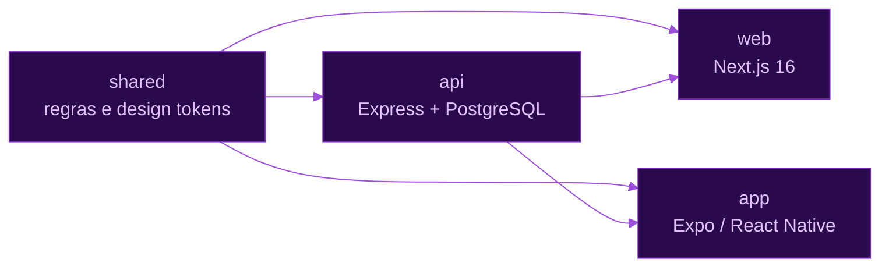
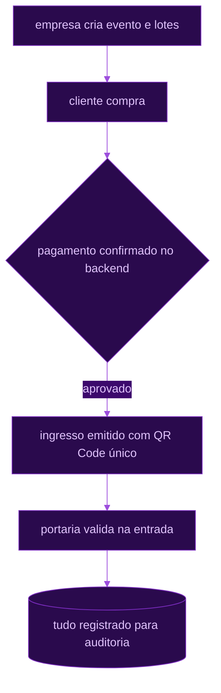

<p align="center">
  
</p>

<p align="center">
  <a href="https://portfolio-delta-five-78.vercel.app"></a>
  <a href="https://linkedin.com/in/lucas-chacon-129414a7"></a>
  <a href="mailto:lucaschacon79@gmail.com"></a>
  <a href="https://github.com/ChaconLucas?tab=repositories"></a>
</p>


<p align="center">
  
</p>

Trabalho no ciclo completo: modelo os dados, escrevo a API, monto o front e coloco no ar —
de plataformas em FastAPI + React a e-commerces em PHP com checkout e CMS próprios,
sempre com um olhar de segurança por causa da pós.

<br>


<p align="center">
  
</p>

<p align="center"><sub>bibliotecas e ferramentas</sub></p>

<p align="center">
  
</p>

<details>
<summary><code>>_ ver a lista completa por camada</code></summary>

<br>


</details>

<br>


<table>
  <tr>
    <td width="50%" valign="top">

### TIIX
**Full Stack Developer** &nbsp;·&nbsp; `2026 — atual`

    

Ponta a ponta dentro do sistema: **consultas e procedures em SQL**, **APIs
REST/JSON** com seus endpoints, e as telas que consomem esses dados — tabelas,
filtros, formulários e gráficos em Bootstrap + jQuery. Também **integrações
OAuth 2.0** com APIs externas, **webhooks** e rotinas agendadas em **cron**.

</td>
<td width="50%" valign="top">

### D&Z
**Desenvolvedor Full Stack** &nbsp;·&nbsp; `nov/2025 — abr/2026`

  

Painéis administrativos em PHP — sistema interno de gestão, com as telas
de cadastro, listagem e manutenção dos dados.

</td>
  </tr>
</table>

<br>


<table>
  <tr>
    <td width="50%" valign="top">

### ⚡ FLASH
    

Marketplace de materiais para tatuagem e body piercing com entrega rápida por motoboy.
Monorepo com quatro pacotes — `shared` (regras e design tokens), `api` (Express +
PostgreSQL), `web` (Next.js 16) e `app` (Expo / React Native) — mantendo **paridade
total entre app e web**. Integração de frete com Uber Direct e deploy contínuo na Render.

<details>
<summary><code>&gt;_ ver o monorepo</code></summary>



</details>

<a href="https://flash-web-srgm.onrender.com"></a>


</td>
<td width="50%" valign="top">

### 🎟️ GateCheck
   

Plataforma de venda de ingressos e controle de entrada para boates e eventos.
Fluxo completo: empresa cria evento e lotes → cliente compra → pagamento confirmado
no backend → ingresso emitido com **QR Code único** → portaria valida na entrada →
tudo registrado para auditoria.

<details>
<summary><code>&gt;_ ver o fluxo</code></summary>



</details>


</td>
  </tr>
  <tr>
    <td width="50%" valign="top">

### 🏄 WSL SporTV Games
  

MVP de jogos interativos para o WSL SporTV: *Drop Sua Onda* (quiz que gera um perfil
de surfista) e *Jurado por Um Dia* (o usuário dá a nota e compara com a do juiz oficial).
Cadastro configurável antes ou depois da partida, com premiação no final.

<a href="https://wsl-sportv-games.vercel.app"></a>


</td>
<td width="50%" valign="top">

### 🛍️ Rare7 — E-commerce completo
  

Plataforma de e-commerce que lidero tecnicamente: loja virtual, painel administrativo,
CMS integrado, checkout **MercadoPago**, automação de e-mails, dashboards com Chart.js,
chat com IA (Groq) e logs de auditoria.

<a href="https://github.com/ChaconLucas/rare7"></a>

</td>
  </tr>
  <tr>
    <td width="50%" valign="top">

### 🏭 Factory Production Management
  

Sistema full stack de gestão de produção fabril: planejamento inteligente de ordens,
controle de estoque e insights de eficiência a partir dos dados de manufatura.

<a href="https://github.com/ChaconLucas/projdata_project"></a>

</td>
<td width="50%" valign="top">

### 🤖 Bot da FURIA
  

Bot de Telegram para a torcida da FURIA (CS): próximos jogos, lineup atual, últimos
resultados e frases da torcida — com scraping para manter os dados atualizados.

<a href="https://github.com/ChaconLucas/furia-telegram-bot"></a>

</td>
  </tr>
  <tr>
    <td width="50%" valign="top">

### 🎤 Tiixokê
   

Karaokê web: busca a música no YouTube, toca o vídeo com a letra e **pontua você de
0 a 100** analisando volume e variedade de pitch captados pelo microfone em tempo real,
com animação de suspense na revelação da nota.


</td>
<td width="50%" valign="top">

### 📱 Gestão de Clientes e Produtos
   

App mobile com banco local, Redux Toolkit, React Hook Form + Yup e Expo Router —
CRUD de clientes e produtos com vínculos entre eles.

<a href="https://github.com/ChaconLucas/react_native_target"></a>

</td>
  </tr>
  <tr>
    <td width="50%" valign="top">

### 🧠 AIpply
`JavaScript` `Python`

Automação de candidaturas com apoio de IA — leitura de vaga, adequação do perfil e
geração do material de aplicação.


</td>
<td width="50%" valign="top">

### ⌚ Integrações de wearables
  

Integração com múltiplas plataformas de wearables e APIs de saúde: fluxo de
autorização, troca e renovação de token, callback e sessão por provedor,
com dashboard para os dados de cada um.

`🏢 trabalho da TIIX`

</td>
  </tr>
</table>

<br>


<p align="center">
  <picture>
    <source media="(prefers-color-scheme: dark)" srcset="https://raw.githubusercontent.com/ChaconLucas/ChaconLucas/output/github-contribution-grid-snake-dark.svg" />
    <source media="(prefers-color-scheme: light)" srcset="https://raw.githubusercontent.com/ChaconLucas/ChaconLucas/output/github-contribution-grid-snake.svg" />
    
  </picture>
</p>

<br>


```bash
$ ./contato.sh
[+] portfolio .. portfolio-delta-five-78.vercel.app
[+] linkedin ... linkedin.com/in/lucas-chacon-129414a7
[+] e-mail ..... lucaschacon79@gmail.com
[+] local ...... Rio de Janeiro — BR (remoto ou híbrido)
```

<p align="center">
  
</p>

<p align="center">
  
</p>
